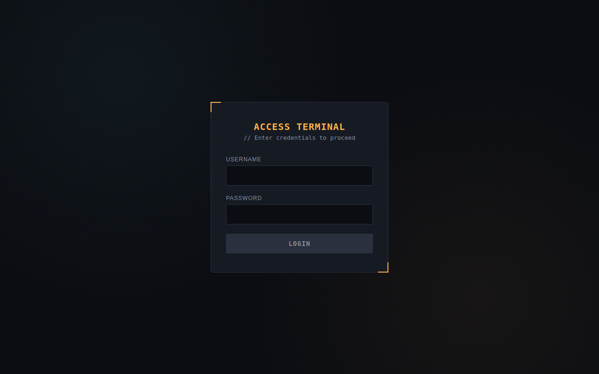
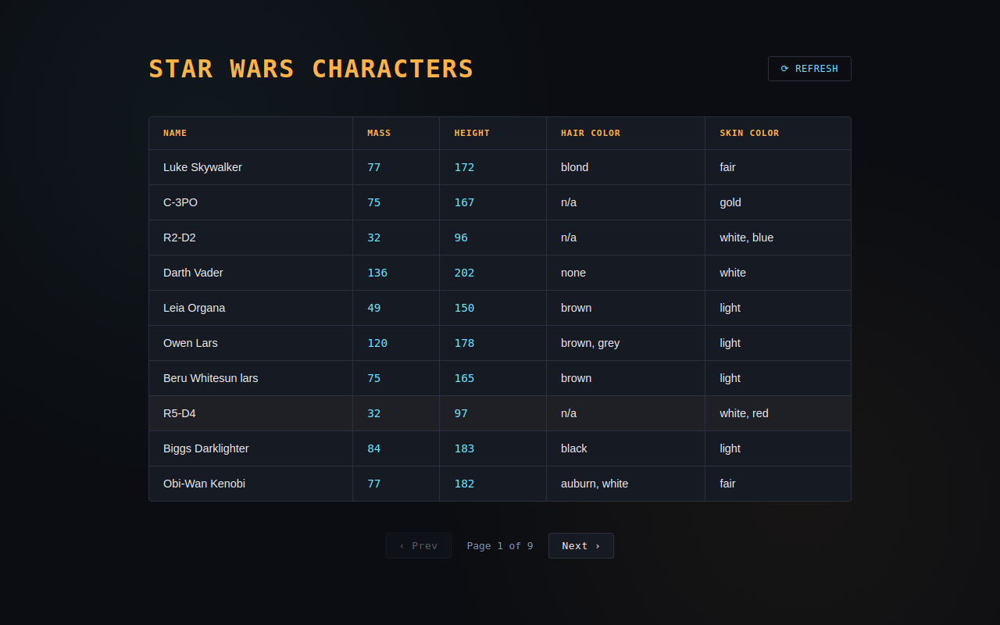
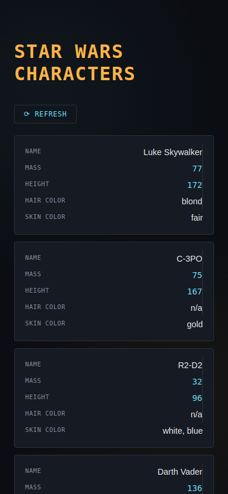

# Star Wars Archive Terminal

A responsive React + TypeScript app with a validated login form and a paginated, cached data table pulling character records from the [Star Wars API](https://swapi.py4e.com/api/people). Styled as an in-universe archive terminal — dark HUD panels, amber accents, and monospace data readouts.

## Features

- **Login form** with live validation (4–30 characters, required) and a debounced error display so messages don't flicker while typing
- **Protected routing** via `react-router-dom` and a Context-based auth guard — `/table` redirects to `/` unless logged in
- **Paginated data table** showing name, mass, height, hair color, and skin color for each character
- **localStorage caching** with TTL-based validation, plus a manual force-refresh button to bypass the cache
- **Loading, error, and offline states** — a themed spinner, a retry-able error panel, and a connection-lost modal (testable via DevTools' network throttling)
- **Responsive design** — the table collapses into stacked cards on mobile
- **Themed 404 page** for unmatched routes

## Screenshots

**Login**



**Character table**



**Mobile view**



## Tech Stack

- React 18 + TypeScript
- Vite
- react-router-dom
- Context API (auth state)
- Browser `localStorage` (caching, no backend)
- Plain CSS with custom properties (no UI framework)

## Getting Started

```bash
npm install
npm run dev
```

Visit `http://localhost:5173`.

**Test credentials:**
- Username: `Martines`
- Password: `starwars`

## Testing the Offline Modal

Open DevTools → Network tab → set throttling to **Offline**. A "Signal Lost" modal appears immediately; set throttling back to **Online** and trigger it again to confirm it re-arms after being dismissed.

## Project Structure

```
src/
├── components/     # LoginForm, Pagination, ErrorState, OfflineModal, LoadingSpinner, ProtectedRoute
├── context/        # AuthContext
├── hooks/          # useDebounce, useOnlineStatus
├── pages/          # Login, Table, NotFound
├── services/       # swapi.ts (fetch + cache integration)
├── types/          # swapi.ts (Person, SwapiResponse)
├── utils/          # validation.ts, cache.ts
└── db.ts           # mock credential store
```

See `AGENTS.md` in the project root for detailed architectural notes and decisions.
